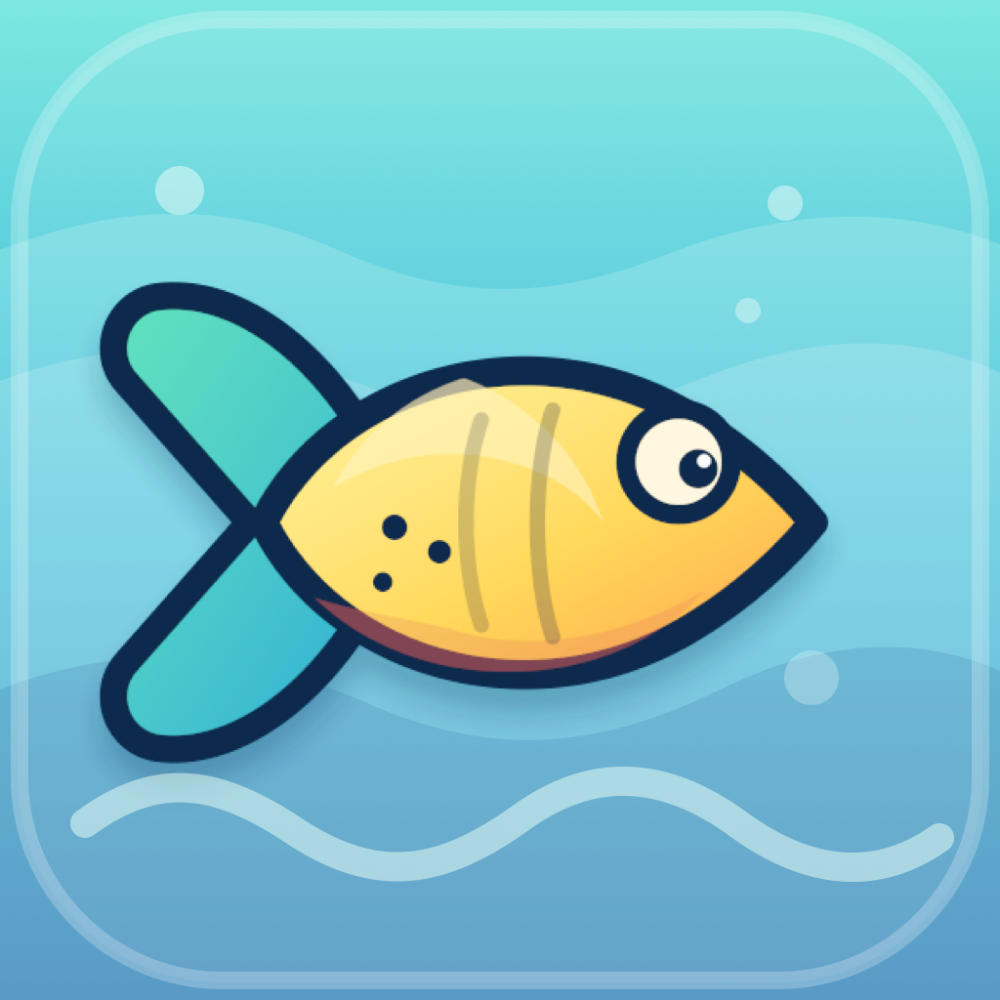
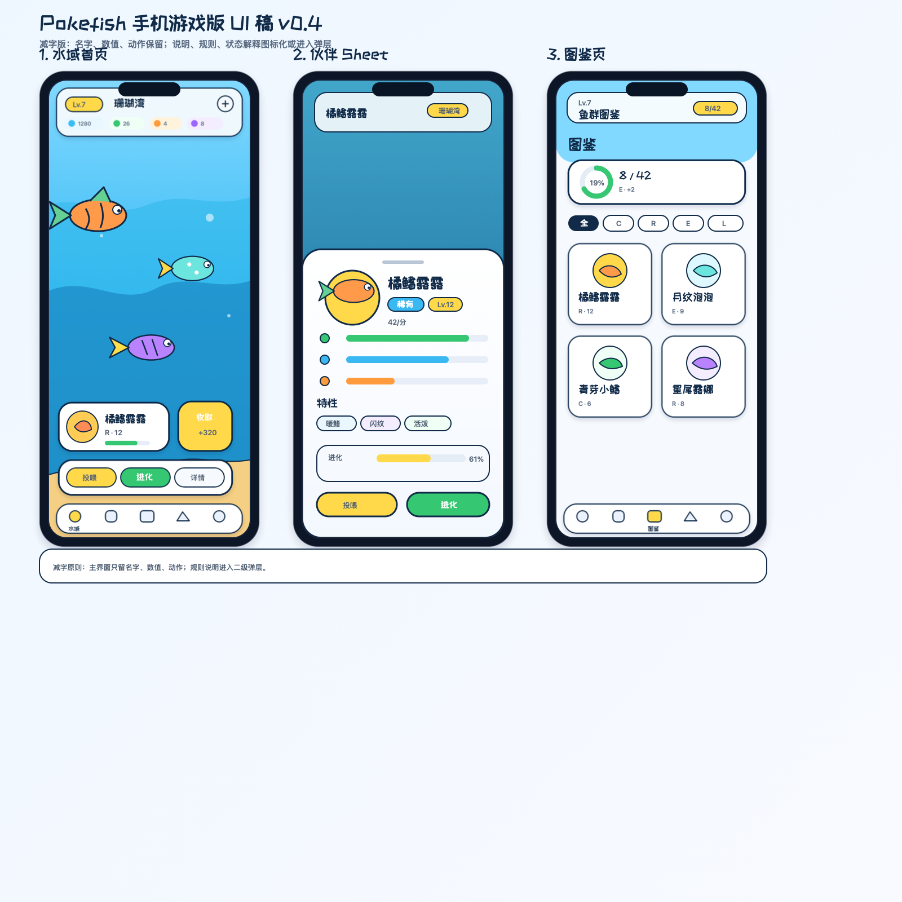

# Pokefish

<p align="center">
  
</p>

<p align="center">
  <strong>把一片像素海域装进口袋。</strong><br>
  A pocket-sized pixel aquarium about raising, discovering, and evolving fish companions.
</p>

<p align="center">
  <strong>Godot 4.6.3+</strong> · <strong>Portrait Mobile</strong> · <strong>iPhone First</strong> · <strong>Pixel Aquarium</strong>
</p>

<p align="center">
  
</p>

中文 | [English](#english)

## 中文

Pokefish 是一款竖屏手机养成游戏。玩家会拥有一片小小的像素海域，照顾伙伴鱼、收集资源、孵化新生命，并让鱼一步步进化成更稀有的形态。

它不是一个管理表格式的养鱼工具，而是一个可以反复打开、轻轻点几下、看鱼游动和成长的口袋水族箱。

### 游戏特色

- 像素风鱼类伙伴：鱼不只是数值卡片，而是在水域里游动、被选择、被喂养和成长的伙伴。
- 竖屏单手体验：界面以手机拇指操作为核心设计，主动作集中在底部。
- 轻量养成循环：投喂、收取、孵化、进化和目标任务共同推动每日成长。
- 图鉴收集目标：通过孵化与进化解锁更多鱼类形态，形成清晰的收集动力。
- 场景化 UI：孵化、图鉴、远行、目标不再只是列表，而是更接近手机游戏的功能场景。
- 本地存档：当前版本使用本地存档保存玩家进度，适合真机原型测试。

### 当前玩法

```text
照顾伙伴鱼 -> 收取资源 -> 孵化新鱼 -> 培养进化 -> 解锁图鉴 -> 完成目标
```

主要系统：

- 伙伴系统：选择、查看和管理当前水域中的鱼。
- 投喂系统：不同鱼饲料有消耗和喂养限制，过度喂养会带来负面影响。
- 资源系统：从水域成长和日常操作中获得养成资源。
- 孵化系统：通过孵化槽获得新的鱼类伙伴。
- 进化系统：满足条件后解锁新的鱼形态。
- 图鉴系统：按更清晰的分类方式记录已发现和未发现的鱼。
- 远行和目标：为玩家提供阶段性方向和额外奖励。

### 项目状态

Pokefish 目前处于 Godot 原生 App 原型开发阶段：

- 已移除旧 Web 和 Capacitor 工程。
- 当前工程只保留 Godot App 版本。
- 当前优先目标是 iPhone 竖屏真机测试。
- Android 安装包支持会在移动端体验稳定后继续推进。

### 体验目标

Pokefish 的方向是“轻松、明亮、可爱、低压力”：

- 打开 App 第一眼看到的是水域和鱼。
- 常用动作可以快速完成，不需要读大量说明文字。
- 鱼的成长要有视觉反馈，而不只是数字变化。
- UI 要服务于游戏世界，而不是盖住游戏世界。

### 开发信息

使用 Godot 4.6.3 或更新版本打开仓库根目录：

```text
project.godot
```

主场景：

```text
res://godot/scenes/ui/main_game.tscn
```

iPhone 调试导出：

```bash
./godot/scripts/qa/ios_debug_deploy.sh
```

QA 验证：

```bash
./godot/scripts/qa/run_all_qa.sh
```

更多 Godot 和 iOS 导出说明：

- `godot/README.md`
- `godot/IOS_EXPORT.md`

### 项目结构

```text
project.godot                         Godot 项目入口
export_presets.cfg                    导出配置
godot/scenes/ui/main_game.tscn        主场景
godot/scripts/                        游戏逻辑和 UI 脚本
godot/assets/                         已选用的游戏资源
godot/assets/pixel_fish_pack/         像素风鱼类素材
godot/scripts/qa/                     QA 和真机测试脚本
docs/design/                          设计方案和 UI 重构文档
docs/qa/                              真机测试记录和验收文档
resource_packages/                    原始素材包，仅用于本地挑选资源
```

## English

Pokefish is a portrait-first mobile raising game. Players keep a small pixel ocean, care for fish companions, collect resources, hatch new life, and evolve fish into rarer forms.

It is not meant to feel like a management dashboard. The goal is a pocket aquarium that players can open often, tap lightly, and enjoy watching their fish move, grow, and change.

### Highlights

- Pixel fish companions: fish are not just stat cards; they swim, react, get selected, get fed, and grow inside the pond.
- Portrait one-hand play: the interface is designed around mobile thumb reach, with primary actions near the bottom.
- Lightweight raising loop: feeding, collecting, hatching, evolution, and quests work together as the daily progression loop.
- Collection-driven dex: hatching and evolution unlock more fish forms and give players a clear collection goal.
- Scene-based UI: hatchery, dex, adventure, and quest flows are designed as mobile game scenes instead of plain lists.
- Local save data: the current build stores progress locally and is suitable for device prototype testing.

### Gameplay Loop

```text
Care for fish -> Collect resources -> Hatch new fish -> Raise and evolve -> Unlock dex entries -> Complete goals
```

Core systems:

- Partner system: select, inspect, and manage fish in the pond.
- Feeding system: fish food has costs and feeding limits; overfeeding can create negative effects.
- Resource system: earn raising resources from pond growth and routine actions.
- Hatchery system: use hatchery slots to obtain new fish companions.
- Evolution system: unlock new fish forms when evolution requirements are met.
- Dex system: track discovered and undiscovered fish through clearer categories.
- Adventure and quest systems: provide short-term goals and extra rewards.

### Project Status

Pokefish is currently a Godot-native app prototype:

- The old Web and Capacitor projects have been removed.
- This repository now keeps only the Godot app version.
- The current priority is portrait iPhone device testing.
- Android package support will follow after the mobile experience becomes more stable.

### Experience Goals

Pokefish is aiming for a cozy, bright, readable, low-pressure feel:

- The pond and fish should be the first thing players notice.
- Frequent actions should be quick, with minimal explanatory text.
- Fish growth should feel visible, not only numerical.
- UI should support the game world instead of covering it.

### Development

Open the repository root with Godot 4.6.3 or newer:

```text
project.godot
```

Main scene:

```text
res://godot/scenes/ui/main_game.tscn
```

iPhone debug export:

```bash
./godot/scripts/qa/ios_debug_deploy.sh
```

QA verification:

```bash
./godot/scripts/qa/run_all_qa.sh
```

More Godot and iOS export notes:

- `godot/README.md`
- `godot/IOS_EXPORT.md`

### Project Layout

```text
project.godot                         Godot project entry
export_presets.cfg                    Export configuration
godot/scenes/ui/main_game.tscn        Main scene
godot/scripts/                        Gameplay and UI scripts
godot/assets/                         Selected game assets
godot/assets/pixel_fish_pack/         Pixel-style fish assets
godot/scripts/qa/                     QA and device testing scripts
docs/design/                          Design plans and UI refactor notes
docs/qa/                              Device testing records and acceptance notes
resource_packages/                    Raw local asset packs for selection only
```
